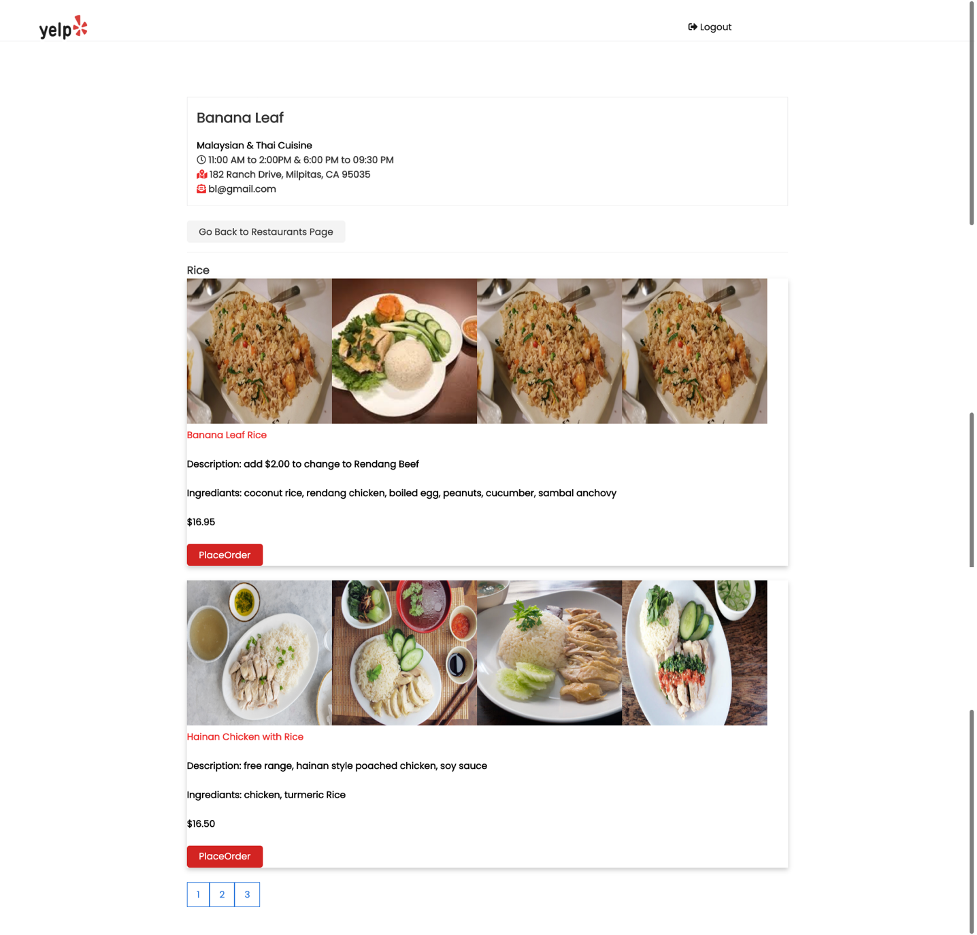

# Lab2: Yelp Prototype using React Redux MongoDB Express

## Backend : Install dependencies and basic express setup
npm init  
npm install express express-validator config bcryptjs gravatar jsonwebtoken passport passport-jwt mongoose request  
npm i -D nodemon  
 

## Frontend: Install dependencies and basic react-app setup
npx create-react-app frontend  
npm install axios react-router-dom redux react-redux redux-thunk redux-devtools-extension moment react-moment 

## MongoDB Connection 
Database collections are desined in MongoDB Atlas and the appalication is connected to this. 

#### Persona
Restuarant  
  
User  

#### MongoDB Models
ChatMessages  
RestOrder  
RestProfile  
RestUser  
SocialEvents  
User  
UserProfile  

## Kafka Setup
npm install kafka-node

